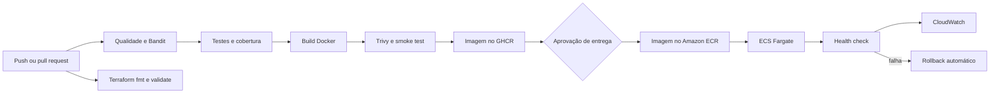

# TaskFlow API - DevOps na Prática

[](https://github.com/Gruiiz/taskflow-devops/actions/workflows/ci.yml)

Projeto acadêmico de Gabriel Ruiz Silva para demonstrar um fluxo DevOps completo. A
TaskFlow é uma API REST de tarefas em Python 3.12, acompanhada por testes automatizados,
container Docker, pipeline de CI/CD no GitHub Actions e infraestrutura AWS declarada com
Terraform.

## O que está implementado

- qualidade, análise estática de segurança, testes e cobertura mínima de 80%;
- validação automática do Terraform;
- build, smoke test e scan de vulnerabilidades da imagem Docker;
- publicação automática de imagens versionadas no GitHub Container Registry;
- entrega aprovada para Amazon ECR e Amazon ECS Fargate;
- health checks, rollback automático e logs estruturados no CloudWatch;
- alarmes de CPU, memória e erros HTTP 5xx, além de dashboard operacional;
- scripts de deploy local, bootstrap AWS, atualização, rollback e destruição.

## Fluxo de CI/CD



O push em `main` entrega uma imagem rastreável pelo SHA do commit. O deploy na AWS é
iniciado manualmente em `Actions > CI/CD - TaskFlow > Run workflow`, mantendo uma barreira
consciente contra consumo acidental do crédito acadêmico.

## Estrutura do repositório

```text
.
├── .github/workflows/ci.yml  # integração e entrega contínuas
├── app/                      # API e logs estruturados
├── tests/                    # testes unitários e de integração
├── infra/                    # ECR, ECS, ALB, CloudWatch e rede
├── scripts/                  # deploy, smoke test, rollback e limpeza
├── docs/                     # arquitetura e relatório das fases
├── Dockerfile
└── compose.yaml
```

## Executar testes e verificações

Requisito: Python 3.12 ou superior.

```bash
python -m pip install --requirement requirements-dev.txt
make quality
make security
make test
```

## Executar com Docker

```bash
./scripts/deploy-local.sh
curl http://localhost:8000/health
curl http://localhost:8000/version
docker compose down
```

A imagem executa sem privilégios, com filesystem somente leitura, capabilities removidas,
health check e limite de rotação dos logs locais.

## Implantar no AWS Academy

O guia completo está em [docs/aws-academy.md](docs/aws-academy.md). Para a primeira
implantação, depois de iniciar o Learner Lab e configurar as credenciais temporárias:

```bash
export ECS_EXECUTION_ROLE_ARN="arn:aws:iam::SEU_ACCOUNT_ID:role/LabRole"
./scripts/bootstrap-aws.sh
```

O script cria primeiro o ECR, publica a imagem e somente então provisiona ECS, ALB,
CloudWatch e rede. Nenhuma credencial é gravada no repositório.

> O ECS Fargate, o Application Load Balancer, o CloudWatch e endereços IPv4 podem consumir
> os créditos da conta. Ao terminar a demonstração, destrua o ambiente.

```bash
CONFIRM_DESTROY=taskflow-dev ./scripts/destroy-aws.sh
```

## Endpoints

- `GET /health`: saúde da aplicação;
- `GET /version`: versão implantada e ambiente;
- `GET /tasks`: lista tarefas;
- `POST /tasks`: cria uma tarefa;
- `GET /tasks/{id}`: consulta uma tarefa;
- `DELETE /tasks/{id}`: remove uma tarefa.

## Documentação

- [Arquitetura e fluxo completo](docs/architecture.md)
- [Configuração do AWS Academy](docs/aws-academy.md)
- [Relatório técnico da Fase 2](docs/relatorio-fase2.md)
- [Infraestrutura Terraform](infra/README.md)

## Referências oficiais

- [GitHub Actions: implantação no Amazon ECS](https://docs.github.com/actions/deployment/deploying-to-your-cloud-provider/deploying-to-amazon-elastic-container-service)
- [GitHub Actions: OpenID Connect na AWS](https://docs.github.com/actions/deployment/security-hardening-your-deployments/configuring-openid-connect-in-amazon-web-services)
- [Amazon ECS com Application Load Balancer](https://docs.aws.amazon.com/AmazonECS/latest/developerguide/alb.html)
- [Circuit breaker e rollback do Amazon ECS](https://docs.aws.amazon.com/AmazonECS/latest/developerguide/deployment-circuit-breaker.html)
