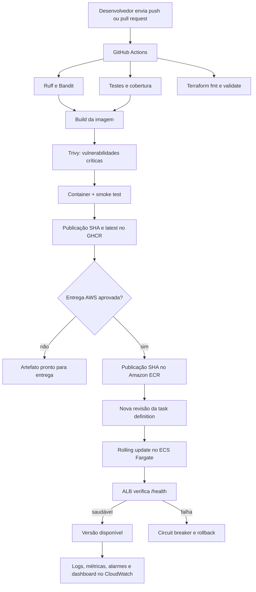
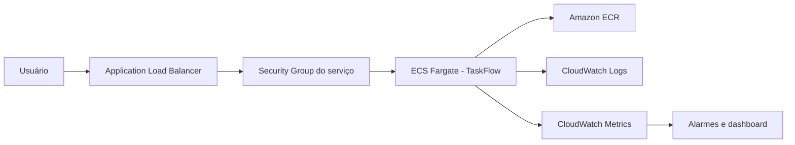

# Arquitetura e fluxo DevOps

## Visão da aplicação

A TaskFlow é uma API REST educacional construída apenas com a biblioteca padrão do
Python 3.12. Os dados são mantidos em memória para que o projeto concentre a avaliação em
automação, infraestrutura, entrega, observabilidade e segurança.

## Fluxo completo

## Arquitetura AWS

O ALB é o único componente que recebe tráfego HTTP público. O security group do container
aceita conexões apenas do security group do balanceador. O container executa sem root,
sem capabilities Linux e com filesystem somente leitura.

## Estratégia de integração contínua

Em pushes e pull requests para `main`, o pipeline executa verificações independentes de
aplicação e infraestrutura. O build do container só começa depois dos testes. A imagem é
inicializada temporariamente e recebe chamadas em `/health`, `/version` e `/tasks` antes
de poder ser entregue.

## Estratégia de entrega contínua

Cada push aceito em `main` publica duas referências no GHCR:

- a tag imutável com o SHA completo do commit, usada para rastreabilidade;
- a tag `latest`, usada somente como conveniência de desenvolvimento.

A entrega para produção usa a imagem imutável no ECR. O job `deploy-aws` é acionado por
`workflow_dispatch` com `deploy_aws=true` e utiliza o ambiente GitHub `production` como
barreira de aprovação. Essa escolha caracteriza entrega contínua: toda versão aprovada é
implantável, mas a execução na conta acadêmica é consciente de custos.

## Configuração e segredos

Configurações não sensíveis são passadas por variáveis de ambiente (`APP_ENV`,
`APP_VERSION` e `LOG_LEVEL`). Credenciais não são incluídas na imagem, no Terraform nem no
código. O workflow aceita OIDC quando uma role apropriada está disponível; no AWS Academy,
também aceita as três credenciais temporárias do Learner Lab armazenadas no ambiente
protegido do GitHub.

## Observabilidade e recuperação

- a aplicação grava um evento JSON por requisição, com request ID, método, rota, status e
  duração;
- o driver `awslogs` encaminha `stdout` e `stderr` ao CloudWatch Logs;
- Container Insights coleta CPU e memória do cluster;
- alarmes detectam CPU ou memória acima de 80% e respostas 5xx do ALB;
- um dashboard reúne as principais métricas operacionais;
- health checks do container e do ALB impedem que uma versão não saudável receba tráfego;
- o circuit breaker do ECS reverte automaticamente uma atualização que não estabiliza;
- `scripts/rollback-aws.sh` permite recuperar manualmente a revisão anterior.

## Decisões e limites

- **Persistência:** o armazenamento em memória é intencional; tarefas são perdidas ao
  reiniciar o container.
- **HTTPS:** a demonstração usa HTTP para evitar domínio e certificado. Produção real deve
  usar ACM e listener HTTPS.
- **Rede:** tarefas usam sub-redes públicas para evitar o custo de NAT Gateway. Uma solução
  real deve avaliar sub-redes privadas e VPC endpoints.
- **Estado Terraform:** o estado permanece local no escopo acadêmico. Trabalho em equipe
  deve usar backend remoto criptografado e locking.
