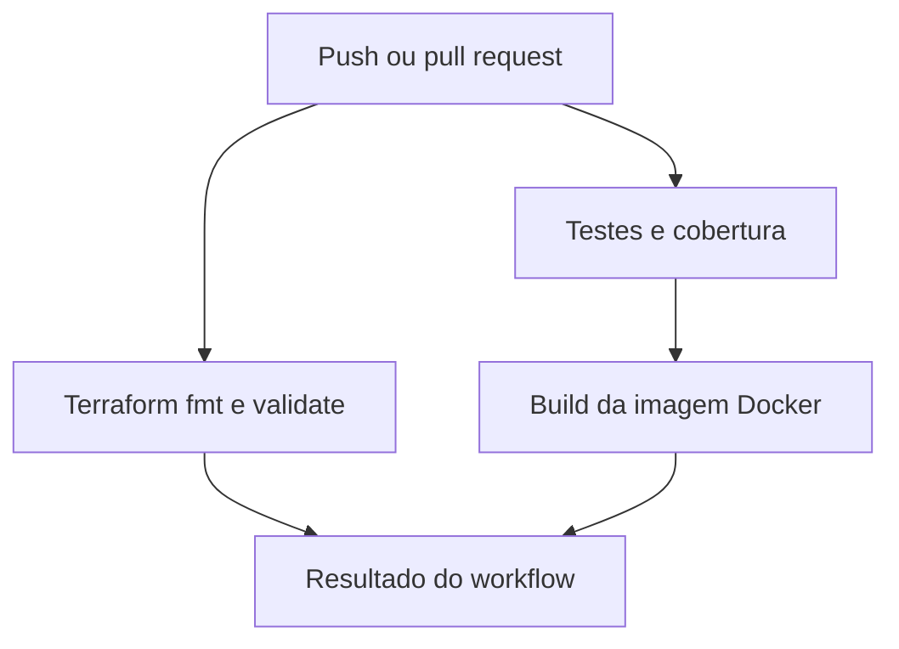
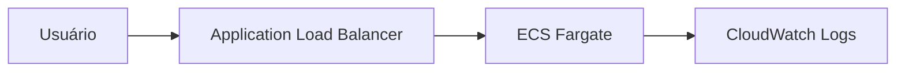

# Arquitetura e fluxo de integração

## Aplicação

A TaskFlow é uma API REST educacional, construída apenas com a biblioteca padrão do
Python 3.12. Os dados são mantidos em memória; esse recorte é intencional para que a Fase 1
se concentre em automação, testes e infraestrutura.

Endpoints:

- `GET /health`: verificação de saúde;
- `GET /tasks`: lista tarefas;
- `POST /tasks`: cria uma tarefa a partir de `{"title": "..."}`;
- `GET /tasks/{id}`: consulta uma tarefa;
- `DELETE /tasks/{id}`: remove uma tarefa.

## Fluxo de CI

## Infraestrutura alvo

O `apply` é manual. A separação evita custos acidentais e mantém a integração contínua
focada em validar o código antes de qualquer entrega ou implantação.
